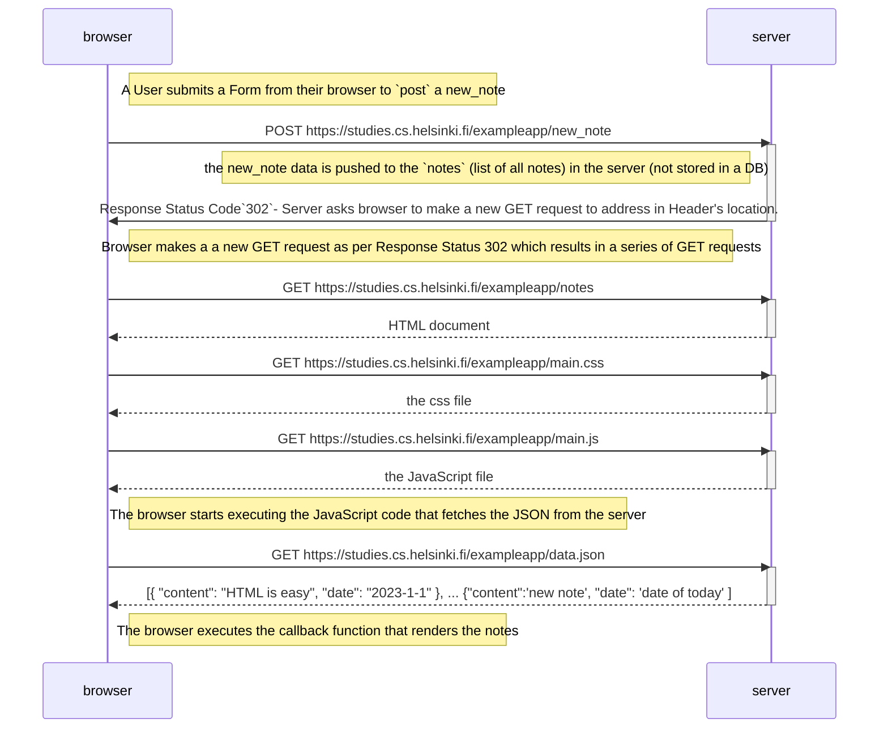
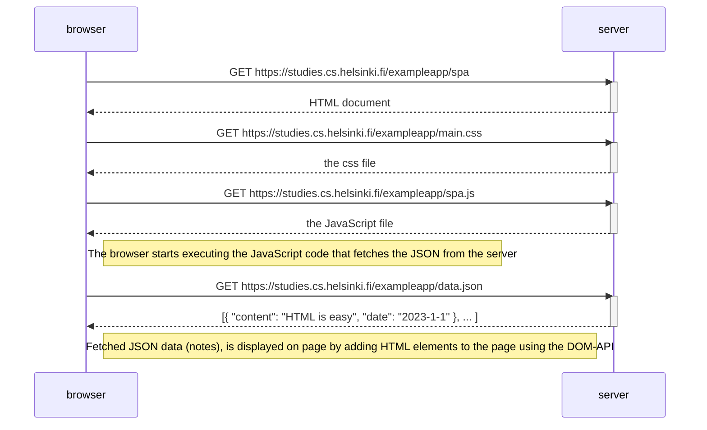
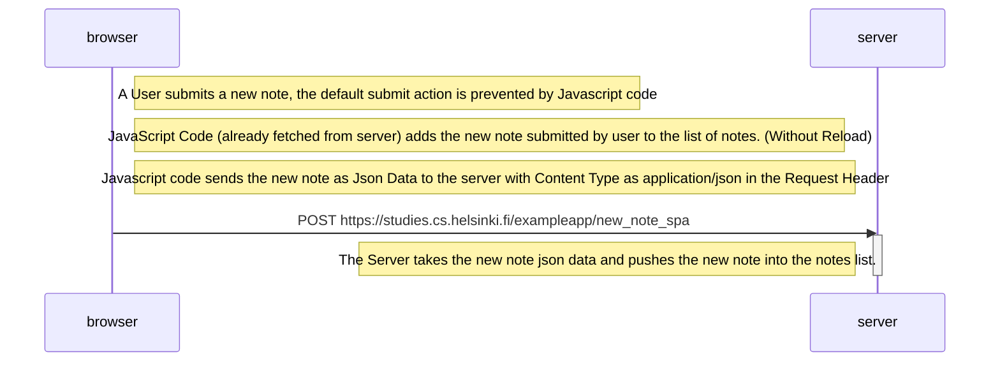

## 0.4: New note diagram

## 0.5: Single page app diagram

## 0.6: New note in Single page app diagram

**It would have been better if the Javascript first POSTed the new note json data to the server, and upon a success message Response
, a new note is rendered on the page.**