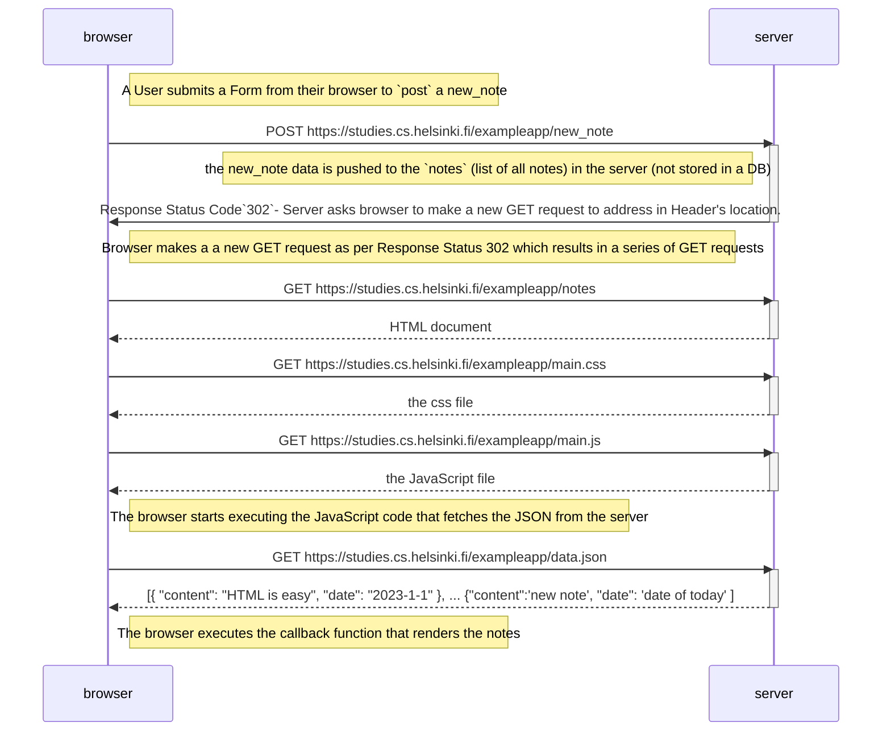

## Solution 4

```mermaid

sequenceDiagram
    participant browser
    participant server

    Note right of browser: A User submits a Form from their browser to `post` a new_note
    browser->>server: POST https://studies.cs.helsinki.fi/exampleapp/new_note
    activate server
    Note left of server: the new_note data is pushed to the `notes` (list of all notes) in the server (not stored in a DB)
    server ->> browser: Response Status Code`302`- Server asks browser to make a new GET request to address in Header's location.
    deactivate server

    Note right of browser: Browser makes a a new GET request as per Response Status 302 which results in a series of GET requests
    browser->>server: GET https://studies.cs.helsinki.fi/exampleapp/notes
    activate server
    server-->>browser: HTML document
    deactivate server

    browser->>server: GET https://studies.cs.helsinki.fi/exampleapp/main.css
    activate server
    server-->>browser: the css file
    deactivate server

    browser->>server: GET https://studies.cs.helsinki.fi/exampleapp/main.js
    activate server
    server-->>browser: the JavaScript file
    deactivate server

    Note right of browser: The browser starts executing the JavaScript code that fetches the JSON from the server

    browser->>server: GET https://studies.cs.helsinki.fi/exampleapp/data.json
    activate server
    server-->>browser: [{ "content": "HTML is easy", "date": "2023-1-1" }, ... {"content":'new note', "date": 'date of today' ]
    deactivate server

    Note right of browser: The browser executes the callback function that renders the notes

```
